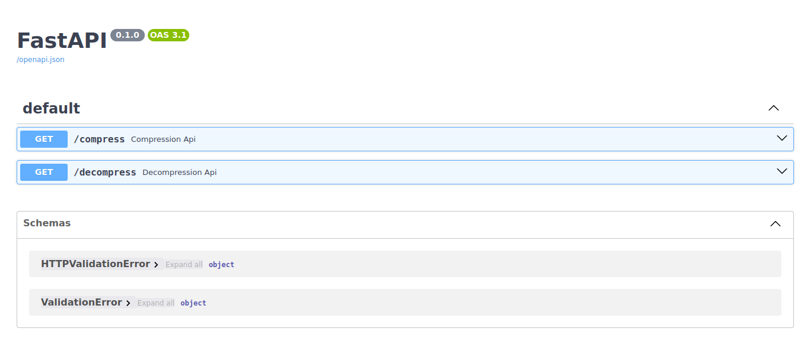

# FastAPI String Compression/Decompression Server

This FastAPI server provides two endpoints for string compression and decompression. The application can be run using Docker for easy deployment.

## Prerequisites

- Docker installed on your machine. You can download Docker [here](https://www.docker.com/get-started).

## Running the Application with Docker

1. Clone the repository:

   ```bash
   git clone https://github.com/Apurv-Salunke/compression_algorith
   ```

2. Change into the project directory:

   ```bash
   cd compression_algorith
   ```

3. Build the Docker image:

   ```bash
   docker build -t compression-server .
   ```

4. Run the Docker container:

   ```bash
   docker run -d -p 8000:8000 compression-server
   ```

    This command starts a container from the compression-server image and maps port 8000 on the host to port 8000 on the container.

5. Access the FastAPI server:
   Open your web browser and go to http://localhost:8000 to access the FastAPI server.


## Usage

Follow the swagger documentation at http://localhost:8000/docs
